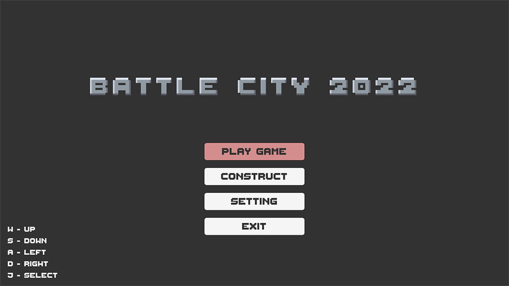
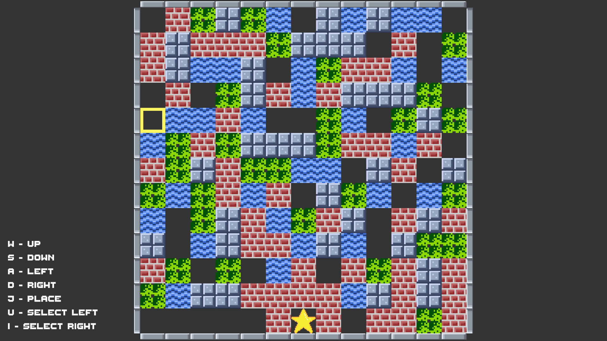
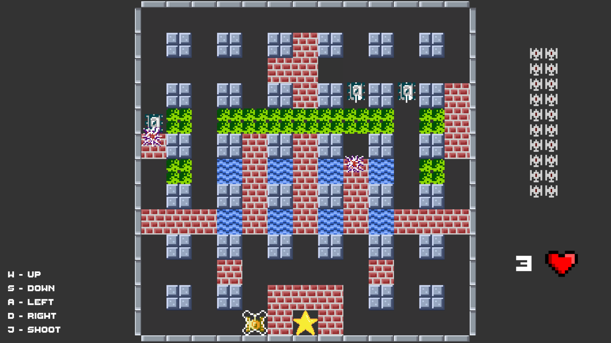

# BattleCity2022 🚙
A personal project of remaking Battle City.
Development enviroment: Unity.
# Rules 📏
1. Player control a tank and protect the base from enemy's invasion.
2. Victory: Successfully protect the base from attacking and destroy all enemy's tanks.
2. Gameover: When player run out of live or the base is destroyed.
# Algorithm 💻
Using A* algorithm and state pattern for the tank's AI.
# Control 🎮
Keyboard and Dualsense is supported.
# Screenshot

